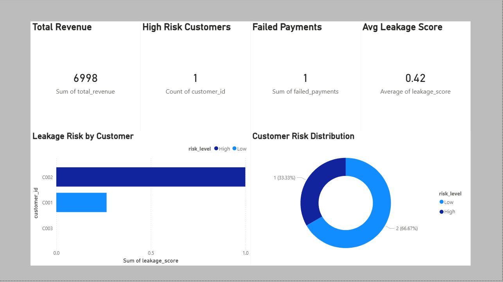

# RevGuard — Revenue Monitoring & Risk Analytics System

RevGuard is a small analytics system designed to monitor financial transactions, detect revenue anomalies, and identify customers that pose potential revenue risk.

The project simulates a real-world analytics workflow used by SaaS and subscription businesses. It generates transaction data, stores it in a SQL database, performs analytics and anomaly detection, and visualizes insights using Power BI.

---

## Problem Statement

Subscription businesses often lose revenue through failed payments, abnormal transactions, and risky customer behavior. These signals are frequently scattered across multiple datasets and are difficult to monitor manually.

RevGuard addresses this by building a simple analytics pipeline that:

• aggregates transaction data
• analyzes payment behavior
• detects anomalies in revenue
• scores customers by risk level
• visualizes insights through an executive dashboard

---

## System Architecture

RevGuard follows a simple analytics pipeline:

Transaction Generator (Python)
→ Raw Dataset (CSV)
→ SQL Database (SQLite)
→ Analytics & Risk Scoring (Python + SQL)
→ Processed Data Export
→ Power BI Dashboard

This structure mirrors how many real analytics systems process operational data.

---

## Key Features

### Transaction Data Generation

Synthetic financial transaction data is generated to simulate real payment activity across multiple regions, plans, and payment methods.

### SQL Data Storage

Transactions are stored in a SQLite database, enabling structured querying and analytics.

### Revenue Analytics

SQL queries calculate important business metrics such as:

• Total revenue
• Successful payments
• Failed payment rate
• Revenue by region
• Revenue by subscription plan

### Revenue Anomaly Detection

Statistical thresholds are used to identify unusually large transactions that may indicate abnormal financial activity.

### Customer Risk Scoring

Each customer receives a risk score based on:

• failed payment rate
• abnormal transactions
• payment behavior patterns

Customers are classified as:

Low Risk
Medium Risk
High Risk

### Power BI Dashboard

A dashboard visualizes key insights including:

• total revenue
• transaction volume
• failed payment trends
• revenue distribution by region and plan
• high-risk customers requiring investigation

---

## Project Structure

```
RevGuard
│
├── dashboards
│   ├── revguard_revenue_monitoring_dashboard.pbix
│   ├── executive_overview.png
│   └── risk_monitoring.png
│
├── data
│   ├── raw
│   │   └── transactions.csv
│   └── processed
│
├── database
│   └── revguard.db
│
├── scripts
│   ├── etl
│   │   ├── generate_transactions.py
│   │   └── load_transactions_to_db.py
│   │
│   └── analysis
│       ├── revenue_metrics.py
│       ├── anomaly_detection.py
│       ├── risk_scoring.py
│       └── export_for_powerbi.py
│
└── README.md
```

---

## Dashboard Preview

### Executive Overview



### Risk Monitoring


---

## Tech Stack

Python
Pandas
SQLite
Power BI
Git / GitHub

---

## How to Run the Project

### 1. Generate transaction dataset

```
python scripts/etl/generate_transactions.py
```

### 2. Load transactions into the SQL database

```
python scripts/etl/load_transactions_to_db.py
```

### 3. Generate analytics metrics

```
python scripts/analysis/revenue_metrics.py
```

### 4. Run anomaly detection

```
python scripts/analysis/anomaly_detection.py
```

### 5. Calculate customer risk scores

```
python scripts/analysis/risk_scoring.py
```

### 6. Export processed datasets for Power BI

```
python scripts/analysis/export_for_powerbi.py
```

---

## Future Improvements

Possible extensions to the project include:

• automated pipeline scheduling
• predictive churn or fraud detection models
• real-time data ingestion
• API-based dashboard data refresh

---

## Author

Samuel Martin
Business Analytics Student

Project created as a portfolio demonstration of analytics pipeline design and revenue monitoring systems.
